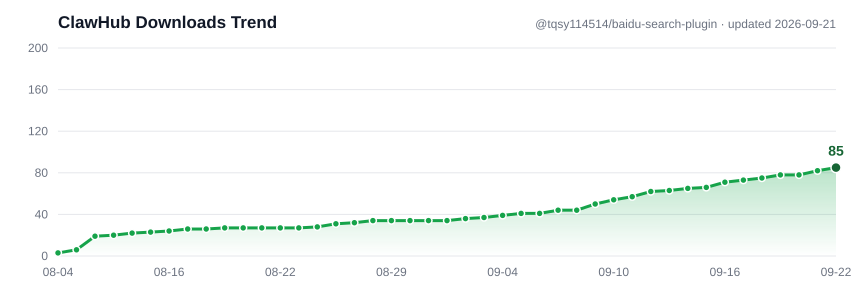

# Baidu AI Search Plugin for OpenClaw




> 趋势图数据由 GitHub Actions 每天自动抓取 ClawHub API 并重绘（见 `.github/workflows/track-downloads.yml`），
> 历史数据见 [`downloads.json`](downloads.json)。

OpenClaw `web_search` 的百度 AI 搜索 Provider。调用百度千帆 `v2/ai_search/web_search`
接口（百度搜索工具），返回结构化搜索结果（标题、链接、摘要、发布时间、站点名），
并支持结果条数、时效/日期范围、站点限定与屏蔽。

> 社区现有的百度搜索插件要么 API 版本过老装不上，要么被安全扫描标记风险。
> 本插件代码量小、完全可审查，key 只发送到百度官方端点
> `https://qianfan.baidubce.com`，绝不经过任何第三方中转。

## 安装

```bash
openclaw plugins install clawhub:@tqsy114514/baidu-search-plugin
```

## 配置

### 1. 获取百度千帆 AI 搜索 API Key

在 [百度智能云千帆控制台](https://console.bce.baidu.com/qianfan/)
开通「百度AI搜索」服务并创建应用，得到 `bce-v3/ALTAK-...` 格式的 API Key。

### 2. 写入配置

```bash
openclaw config set plugins.entries.baidu.config.webSearch.apiKey "bce-v3/ALTAK-..."
openclaw config set tools.web.search.provider baidu
openclaw gateway restart
```

也支持环境变量 `BAIDU_API_KEY`（顺带兼容 `QIANFAN_API_KEY` 作为 fallback）。

#### 推荐：用 SecretRef 而不是明文 key

把 key 放进宿主 secrets，配置里只写引用，避免密钥明文躺在配置文件里：

```bash
openclaw secret set baidu_api_key "bce-v3/ALTAK-..."
openclaw config set plugins.entries.baidu.config.webSearch.apiKey "secretRef:baidu_api_key"
openclaw gateway restart
```

apikey 配置项在插件的 uiHints 里已标记 `sensitive: true`，宿主界面会按密文处理。

### 3. 使用

```bash
openclaw run "帮我搜一下 xxx"
```

或直接在任意会话中调用 `web_search` 工具，provider 显示为 `baidu`。

## 搜索参数

除 `query` 外，`web_search` 支持以下可选参数（均由工具 schema 暴露）：

| 参数 | 说明 | 默认 |
|---|---|---|
| `count` | 返回结果条数，1–10 | 5 |
| `freshness` | 时效快捷值：`pd`/`pw`/`pm`/`py`（日/周/月/年）或 `day`/`week`/`month`/`year`；不可与日期参数同用 | 无 |
| `date_after` | 限定结果发布时间之后，`YYYY-MM-DD` | 无 |
| `date_before` | 限定结果发布时间之前，`YYYY-MM-DD` | 无 |
| `site` | 站点过滤（如 `site:baidu.com` 风格），字符串或数组 | 无 |
| `exclude_sites` | 屏蔽站点，字符串或数组 | 无 |

## 工作原理

- 端点：`POST https://qianfan.baidubce.com/v2/ai_search/web_search`
- 请求体：`{"messages":[{"role":"user","content":"<query>"}], "search_source":"baidu_search_v2", "resource_type_filter":[{"type":"web","top_k":<count>}]}`
- 鉴权：`Authorization: Bearer <bce-v3/ALTAK-...>`，附 `X-Appbuilder-From: openclaw`
- `freshness`/`date_after`/`date_before` 映射为 `search_filter.range.page_time {gte, lt}`，
  `site` 映射为 `search_filter.match.site`，`exclude_sites` 映射为 `block_websites`
- 响应 `references[]` 映射为标准 `web_search` 结果，自带结果缓存
  （缓存 key 覆盖 query/count/时效/站点等全部维度）

## 安全

- 复用 OpenClaw SDK 的 `withTrustedWebSearchEndpoint`（SSRF 防护）、
  搜索结果缓存、外部内容包裹（untrusted 标记）等机制
- 插件不含任何密钥，key 从配置（支持 SecretRef）或环境变量读取

## License

MIT