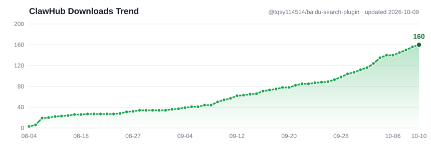

# Baidu AI Search Plugin for OpenClaw

[English](README.en.md) | 中文




> 趋势图数据由 GitHub Actions 每天自动抓取 ClawHub 插件页面并重绘（见 `.github/workflows/track-downloads.yml`），
> 历史数据见 [`downloads.json`](downloads.json)。

OpenClaw `web_search` 的百度 AI 搜索 Provider。调用百度千帆 `v2/ai_search/web_search`
接口（百度搜索工具），返回结构化搜索结果（标题、链接、摘要、发布时间、站点名），
并支持结果条数、时效/日期范围、站点限定与屏蔽。

> 社区现有的百度搜索插件要么 API 版本过老装不上，要么被安全扫描标记风险。
> 本插件代码量小、完全可审查，key 只发送到百度官方端点
> `https://qianfan.baidubce.com`，绝不经过任何第三方中转。

## 安装

```bash
openclaw plugins install clawhub:@tqsy114514/baidu-search-plugin
```

## 配置

### 1. 获取百度千帆 AI 搜索 API Key

在 [百度智能云千帆控制台](https://console.bce.baidu.com/qianfan/)
开通「百度AI搜索」服务并创建应用，得到 `bce-v3/ALTAK-...` 格式的 API Key。

### 2. 写入配置

```bash
openclaw config set plugins.entries.baidu.config.webSearch.apiKey "bce-v3/ALTAK-..."
openclaw config set tools.web.search.provider baidu
openclaw gateway restart
```

也支持环境变量 `BAIDU_API_KEY`（顺带兼容 `QIANFAN_API_KEY` 作为 fallback）。

#### 推荐：用 SecretRef 而不是明文 key

把 key 放进宿主 secrets，配置里只写引用，避免密钥明文躺在配置文件里：

```bash
openclaw secret set baidu_api_key "bce-v3/ALTAK-..."
openclaw config set plugins.entries.baidu.config.webSearch.apiKey "secretRef:baidu_api_key"
openclaw gateway restart
```

apikey 配置项在插件的 uiHints 里已标记 `sensitive: true`，宿主界面会按密文处理。

### 3. 使用

```bash
openclaw run "帮我搜一下 xxx"
```

或直接在任意会话中调用 `web_search` 工具，provider 显示为 `baidu`。

## 搜索参数

除 `query` 外，`web_search` 支持以下可选参数（均由工具 schema 暴露）：

| 参数 | 说明 | 默认 |
|---|---|---|
| `query` | 搜索关键词；首尾空白自动去除，空字符串拒绝（`empty_query`），超 500 字符截断；百度只检索前 72 个字符（汉字算 2 个），超出时自动开启百度 query 改写（`query_policy.enable_rewrite`） | 必填 |
| `count` | 返回结果条数，钳制在 1–10（小数向下取整，非数字回退默认） | 5 |
| `freshness` | 时效快捷值：`pd`/`pw`/`pm`/`py`（日/周/月/年）或 `day`/`week`/`month`/`year`；不可与日期参数同用 | 无 |
| `date_after` | 限定结果发布时间从这一天起（含当天），`YYYY-MM-DD` | 无 |
| `date_before` | 限定结果发布时间截止到这一天（含当天），`YYYY-MM-DD` | 无 |
| `site` | 站点过滤（如 `site:baidu.com` 风格），字符串或数组；自动归一化为小写域名（去掉 `site:`、协议和路径）并去重；最多 20 个（百度上限） | 无 |
| `exclude_sites` | 屏蔽站点，字符串或数组；归一化规则同 `site` | 无 |

## 结果处理

- **去重**：按归一化 URL 去重（忽略大小写、fragment、尾部斜杠），保留第一条
- **摘要截断**：单条摘要超 500 字符截断并加 `…`
- **清理控制字符**：去掉百度在标题/摘要里嵌入的 `\u0004`/`\u0005` 等高亮标记
- **附加字段**：`siteName` 优先用百度返回的站点名 `website`；百度给出时附带 `rerankScore`（相关性）、`authorityScore`（权威性，均为 0–1）和百家号作者 `author`
- **发布时间归一化**：`YYYY-M-D`/`YYYY/M/D` 补零、`YYYY年M月D日`、时间戳、可解析日期统一转 `YYYY-MM-DD`（时间戳等按北京时间取日期，不受宿主时区影响），解析不了的保留原文

## 容错

- 瞬时错误（429/502/503/504、超时、网络错误）自动重试最多 2 次（300ms/800ms 退避；429 有 `Retry-After` 头时按头等待，上限 10s，避免长时间 sleep 拖爆宿主工具调用超时）；401/403 类直接抛；免费额度用完 / 欠费（百度同样用 429 返回）不重试
- 工具调用被取消时立即中止请求与重试等待
- **省配额**：同时发起的相同搜索合并成一次请求；只有全部调用方都取消时才中止这次请求
- 百度返回 `code != 0`（数字码或 `QUOTA_USER_DAILY_FREE` 这类字符串码）时返回结构化 `baidu_search_error`（带 `code`、`requestId` 字段供调用方按码降级），不抛异常中断工具循环
- **可操作提示**：Key 无效、免费额度用完、欠费、QPS 超限等常见错误会附带中文处理建议（结构化错误里的 `hint` 字段，或追加在抛出的错误信息末尾）

## 缓存与超时

两项都读宿主的通用 `web_search` 配置：

| 配置 | 说明 | 默认 |
|---|---|---|
| `tools.web.search.cacheTtlMinutes` | 结果缓存分钟数；百度免费额度为每月 1500 次（约每天 50 次），调大可以省配额；`0` 关闭缓存 | 15 |
| `tools.web.search.timeoutSeconds` | 单次请求超时（秒）；重试时每次单独计时 | 30 |

```bash
openclaw config set tools.web.search.cacheTtlMinutes 60
```

## 工作原理

- 端点：`POST https://qianfan.baidubce.com/v2/ai_search/web_search`
- 请求体：`{"messages":[{"role":"user","content":"<query>"}], "search_source":"baidu_search_v2", "resource_type_filter":[{"type":"web","top_k":<count>}]}`
- 鉴权：`Authorization: Bearer <bce-v3/ALTAK-...>`，附 `X-Appbuilder-From: openclaw`
- `freshness`（`pd`/`pw`/`pm`/`py` 或 `day`/`week`/`month`/`year`）映射为顶层 `search_recency_filter`
 （`day`/`week`/`month`/`year`，百度文档值；`page_time` 实测被百度忽略，不用），
  `date_after`/`date_before` 映射为 `search_filter.range.page_time {gte, lte}`（两端都包含；百度要求两端同时存在，只给一侧时另一侧补 `2000-01-01` / `2099-12-31`；实测百度不接受具体日期与 `now/d` 混用，且会忽略 `1970-01-01` 下界），
  `site` 映射为 `search_filter.match.site`，`exclude_sites` 映射为 `block_websites`
- 响应 `references[]` 映射为标准 `web_search` 结果，自带结果缓存
  （缓存 key 覆盖 query/count/时效/站点等全部维度）

## 安全

- 复用 OpenClaw SDK 的 `withTrustedWebSearchEndpoint`（SSRF 防护）、
  搜索结果缓存、外部内容包裹（untrusted 标记）等机制
- 插件不含任何密钥，key 从配置（支持 SecretRef）或环境变量读取

## 开发

```bash
npm test            # 单元测试 + index.js 行为测试（用 test/fixtures 里的 SDK 替身，不需要安装 openclaw）
npm run typecheck   # 对 lib/ 做 JSDoc 类型检查（TypeScript checkJs）
BAIDU_API_KEY=bce-v3/ALTAK-... node .github/live-smoke.mjs   # 真实接口冒烟测试，4 次调用
```

- CI：`test` workflow 在 Node 22/24/26 上跑测试并做类型检查
- 真实接口冒烟：`live-smoke` workflow 每天北京时间 09:00 运行，lib/index.js 有改动时也会运行；需要在仓库 Secrets 里配置 `BAIDU_API_KEY`，没配置时自动跳过
- 发布：先升级 `package.json` 版本号并推送，然后在 Actions 里手动运行 **Package publish**；通过 ClawHub trusted publisher（GitHub OIDC）认证，不需要保存 token。PR 上会自动做一次 dry-run

## License

MIT